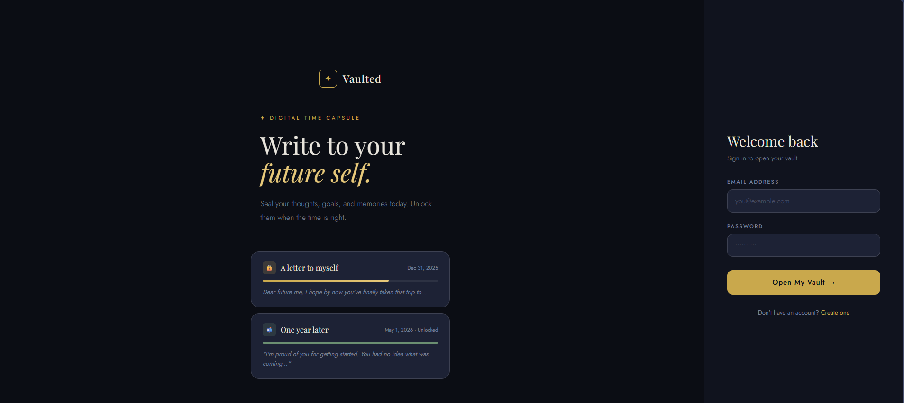
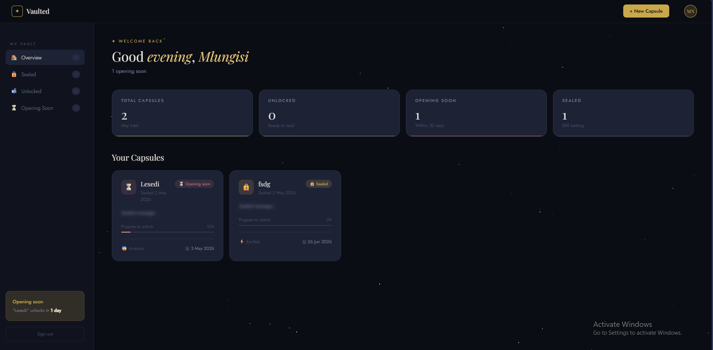
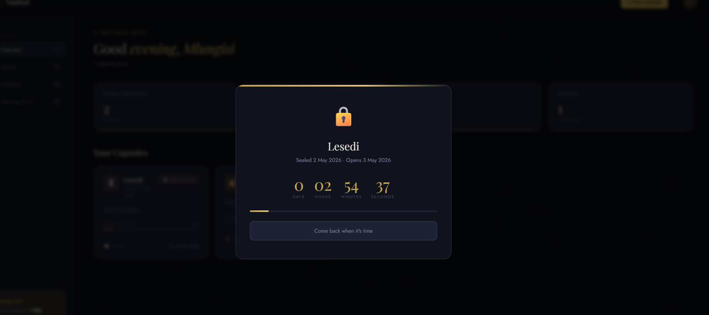

# ✦ Vaulted — Digital Time Capsule

> *Write to your future self. Seal a memory today, unlock it when the time is right.*


---

## Overview

**Vaulted** is a digital time capsule web application that lets users write private messages, seal them with a future unlock date, and revisit them when the time arrives. Built as a single-file frontend with no backend server — it connects directly to [Supabase](https://supabase.com) for authentication and data storage.

---

## Features

- **✦ Auth** — Sign up and sign in via Supabase Auth (email/password)
- **✦ Seal Capsules** — Write a message, pick a mood, set a future unlock date
- **✦ Timed Unlock** — Capsules are blurred and locked until their unlock date passes
- **✦ Live Countdown** — View a real-time countdown for each locked capsule
- **✦ Progress Tracking** — Visual progress bar showing how far along each capsule is
- **✦ Mood Tagging** — Tag each capsule with an emoji mood (Hopeful, Grateful, Anxious, etc.)
- **✦ Dashboard Stats** — See totals for sealed, unlocked, and opening-soon capsules
- **✦ Persistent Sessions** — Supabase handles session refresh automatically
- **✦ No Backend Required** — Runs entirely from a single HTML file

---

## Tech Stack

| Layer | Technology |
|---|---|
| Frontend | Vanilla HTML, CSS, JavaScript |
| Auth | Supabase Auth (email/password) |
| Database | Supabase (PostgreSQL via REST) |
| Fonts | Google Fonts — Playfair Display, Jost |
| Supabase Client | `@supabase/supabase-js` v2 (CDN) |

---

## Getting Started

### 1. Clone the repository

```bash
git clone https://github.com/your-username/vaulted.git
cd vaulted
```

### 2. Set up Supabase

1. Go to [supabase.com](https://supabase.com) and create a new project
2. Open the **SQL Editor** and run the schema below
3. Copy your **Project URL** and **anon public key** from Project Settings → API

### 3. Add your Supabase credentials

Open `index.html` and update these two lines near the top of the `<script>` block:

```js
const SUPABASE_URL      = 'https://your-project.supabase.co';
const SUPABASE_ANON_KEY = 'your-anon-key-here';
```

### 4. Open the app

Serve the file through any static server — do **not** open it directly as a `file://` URL as browsers block fetch requests in that context.

```bash
# Option A — Node
npx serve .

# Option B — Python
python -m http.server 3000

# Option C — VS Code
# Install the Live Server extension and click "Go Live"
```

Then visit `http://localhost:3000`.

---

## Database Schema

Run this in your Supabase **SQL Editor**:

```sql
-- Moods lookup table
CREATE TABLE public.moods (
  id     SERIAL PRIMARY KEY,
  label  TEXT NOT NULL,
  emoji  TEXT
);

INSERT INTO public.moods (label, emoji) VALUES
  ('Hopeful',    '✨'),
  ('Grateful',   '🌿'),
  ('Excited',    '⚡'),
  ('Reflective', '🌊'),
  ('Determined', '💪'),
  ('Content',    '🌸'),
  ('Anxious',    '😰'),
  ('Uncertain',  '🌫️');

-- Capsules table
CREATE TABLE public.capsules (
  id          UUID PRIMARY KEY DEFAULT gen_random_uuid(),
  user_id     UUID NOT NULL REFERENCES auth.users(id) ON DELETE CASCADE,
  title       TEXT NOT NULL,
  message     TEXT NOT NULL,
  mood_id     INTEGER REFERENCES public.moods(id),
  unlock_date DATE NOT NULL,
  notify_pref TEXT DEFAULT 'on_unlock',
  created_at  TIMESTAMPTZ DEFAULT now()
);

-- Enable Row Level Security
ALTER TABLE public.capsules ENABLE ROW LEVEL SECURITY;
ALTER TABLE public.moods    ENABLE ROW LEVEL SECURITY;

-- Policies
CREATE POLICY "capsules: owner only" ON public.capsules
  FOR ALL USING (auth.uid() = user_id)
  WITH CHECK (auth.uid() = user_id);

CREATE POLICY "moods: public read" ON public.moods
  FOR SELECT USING (true);
```

---

## Project Structure

```
vaulted/
└── index.html      # Entire application — HTML, CSS, and JS in one file
└── README.md
```

---

## Screenshots

| Login | Dashboard | Sealed Capsule |
|---|---|---|
|  |  |  |

---

## Deployment

Since Vaulted is a single HTML file, it can be deployed anywhere static files are served:

- **Netlify** — drag and drop the file into [app.netlify.com/drop](https://app.netlify.com/drop)
- **Vercel** — `vercel --prod` from the project folder
- **GitHub Pages** — push to a repo and enable Pages on the `main` branch

No build step required.

---

## Known Limitations

- No email notifications (notify preference is saved but not yet actioned)
- No file attachments (schema supports it but UI is not yet implemented)
- Capsules cannot be edited after sealing — by design

---

## Roadmap

- [ ] Email notifications on unlock day
- [ ] File/image attachments
- [ ] Delete capsule with confirmation
- [ ] Mobile-responsive sidebar
- [ ] Google OAuth sign-in

---

## License

MIT © 2026 — feel free to fork, adapt, and build on this.

---

<div align="center">
  <sub>Built with ✦ and a little patience</sub>
</div>
